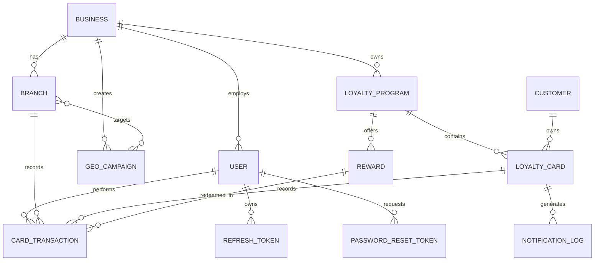
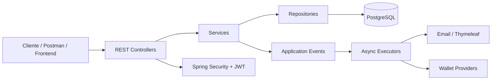

# Fidegresa.GO — Backend

> **CS 2031 · Desarrollo Basado en Plataforma**  
> **Proyecto 1 · Semana 7 — Backend completo**  
> **Equipo:** Manuel Aguirre · Geannyra Cortez · Jennifer Patiño · Jossue Caceres
> 
> **Repositorio:** [[URL DEL REPOSITORIO](https://github.com/Jmanolo2004/DBP-repo-finalroad)]  
> **Deployment:** [URL DEL DEPLOYMENT]  
> **Swagger:** [URL SWAGGER]

---

## Índice

1. [Introducción](#1-introducción)
2. [Problema y justificación](#2-problema-y-justificación)
3. [Solución: funcionalidades y tecnologías](#3-solución-funcionalidades-y-tecnologías)
4. [Modelo de entidades](#4-modelo-de-entidades)
5. [Arquitectura](#5-arquitectura)
6. [Manejo de errores](#6-manejo-de-errores)
7. [Seguridad](#7-seguridad)
8. [Eventos y asincronía](#8-eventos-y-asincronía)
9. [GitHub & Management](#9-github--management)
10. [Conclusión](#10-conclusión)
11. [Apéndices](#11-apéndices)
12. [Criterios cubiertos por la rúbrica](#12-criterios-cubiertos-por-la-rúbrica)

---

## 1. Introducción

Fidegresa.GO es una plataforma SaaS de fidelización que permite a los comercios administrar programas de puntos o sellos mediante tarjetas digitales compatibles con Apple Wallet y Google Wallet. El backend centraliza la administración de negocios, sucursales, trabajadores, clientes, tarjetas, recompensas, campañas de proximidad y métricas.

El objetivo es ofrecer una solución segura y organizada para gestionar la fidelización de clientes. El backend expone una API REST versionada bajo `/api/v1`, utiliza PostgreSQL y aplica una arquitectura Controller → Service → Repository.

El proyecto cumple los criterios técnicos de la rúbrica: más de seis entidades, DTOs especializados, excepciones globales, JWT con refresh tokens, roles, eventos y asincronía, deployment en AWS y documentación.

---

## 2. Problema y justificación

Los programas tradicionales de fidelización pueden depender de tarjetas físicas, registros manuales o procesos poco integrados. Esto dificulta administrar recompensas, historial y operaciones entre sucursales.

Fidegresa.GO centraliza esta gestión: el comercio configura sus programas y los clientes se registran mediante QR y utilizan una tarjeta digital. Los cajeros registran sellos y canjes, mientras los administradores gestionan sucursales, trabajadores, campañas y métricas.

La solución también contempla GeoPush. El backend almacena las coordenadas de las sucursales y la información de las campañas para incorporarlas a los pases digitales. De esta manera, el sistema operativo puede mostrar el aviso de proximidad cuando el cliente se encuentra cerca de una ubicación configurada.

---

## 3. Solución: funcionalidades y tecnologías

### Funcionalidades principales

- Registro, login, refresh y logout mediante JWT.
- Recuperación y restablecimiento de contraseña.
- Gestión de negocios y sucursales.
- Gestión de cajeros y asignación de sucursales.
- Creación y administración de programas de fidelización.
- Creación y administración de recompensas.
- Inscripción pública de clientes mediante QR.
- Creación y consulta de tarjetas de fidelización.
- Registro de sellos y canjes.
- Historial de transacciones.
- Campañas GeoPush asociadas a sucursales.
- Métricas resumidas por período y sucursal.
- Integración con Google Wallet y una interfaz para Apple Wallet.
- Correos HTML mediante plantillas.
- Procesamiento asíncrono de correos, Wallet, notificaciones y auditoría.

### Tecnologías

- Java 21
- Spring Boot 3
- Spring Data JPA
- PostgreSQL
- Spring Security
- JWT
- MapStruct
- Lombok
- Bean Validation
- Spring Mail + Thymeleaf
- Spring Events + `@Async`
- Swagger / OpenAPI
- JUnit 5 + Mockito
- Testcontainers
- JaCoCo
- Docker / Docker Compose
- GitHub Actions
- AWS EC2 + RDS

Las credenciales y secretos se manejan mediante variables de entorno. El archivo `.env` y certificados no deben formar parte del repositorio.

---

## 4. Modelo de entidades

El modelo contempla 12 entidades principales:

| Entidad | Propósito |
|---|---|
| `User` | Usuarios del panel: ADMIN, BRAND_ADMIN y CASHIER. |
| `Business` | Comercio que utiliza la plataforma. |
| `Branch` | Sucursal con coordenadas para GeoPush. |
| `LoyaltyProgram` | Reglas, meta y diseño del programa. |
| `Reward` | Premio canjeable del programa. |
| `Customer` | Consumidor final registrado mediante QR. |
| `LoyaltyCard` | Tarjeta digital con serial, QR, saldo, plataforma y estado. |
| `CardTransaction` | Historial de sellos y canjes. |
| `GeoCampaign` | Campaña de proximidad con vigencia. |
| `RefreshToken` | Token de refresco rotado y revocable. |
| `PasswordResetToken` | Token temporal para recuperación de contraseña. |
| `NotificationLog` | Registro de correos y sincronizaciones enviadas. |

Relaciones relevantes: un `Business` posee sucursales, programas y usuarios; un `LoyaltyProgram` posee recompensas y tarjetas; un `Customer` puede tener varias tarjetas, pero una sola tarjeta por programa; una tarjeta registra sus transacciones; y una campaña puede estar relacionada con múltiples sucursales.

Se utilizan relaciones JPA con `LAZY` explícito en `@ManyToOne`, `mappedBy` en las colecciones y `cascade` únicamente donde existe composición. Las consultas de detalle pueden utilizar `EntityGraph` o `JOIN FETCH` para evitar problemas N+1. Se incluyen constraints e índices para datos como email, QR token, serial y fechas de transacciones.

### Diagrama ER



Los nombres del código se mantienen en inglés para cumplir las convenciones indicadas por la rúbrica.

---

## 5. Arquitectura

El backend sigue una arquitectura por capas y organiza el código por módulos de dominio. Cada módulo puede contener `controller`, `service`, `repository`, `dto`, `mapper`, `entity` y `event`.



Los controllers reciben y validan las solicitudes, delegan el caso de uso al servicio y retornan `ResponseEntity`. No acceden directamente a repositorios ni contienen lógica de negocio. Los servicios mantienen responsabilidades específicas por dominio y las dependencias se inyectan mediante constructor.

Los DTOs separan los datos de entrada y salida de las entidades JPA. Se utilizan mappers, evitando exponer contraseñas, refresh tokens o credenciales internas de Wallet.

---

## 6. Manejo de errores

El sistema utiliza una excepción base `ApiException` con su correspondiente `HttpStatus`. Entre las excepciones personalizadas se encuentran:

- `ResourceNotFoundException` — 404
- `DuplicateResourceException` — 409
- `InvalidOperationException` — 400
- `UnauthorizedException` — 401
- `ForbiddenOperationException` — 403
- `InvalidTokenException` — 401
- `InsufficientStampsException` — 409
- `CardInactiveException` — 409
- `DuplicateScanException` — 409
- `WalletIntegrationException` — 500

Un `@RestControllerAdvice` centraliza las respuestas y también maneja errores de Spring como `MethodArgumentNotValidException`, `ConstraintViolationException`, `HttpMessageNotReadableException`, `MethodArgumentTypeMismatchException`, `AccessDeniedException` y `DataIntegrityViolationException`.

El formato común es:

```json
{
  "timestamp": "2026-09-25T12:00:00",
  "status": 409,
  "error": "Conflict",
  "message": "Resource already exists",
  "path": "/api/v1/...",
  "fieldErrors": {}
}
```

Los errores generados antes de llegar al controller por el filtro JWT se manejan mediante `AuthenticationEntryPoint` para 401 y `AccessDeniedHandler` para 403, manteniendo el mismo formato de respuesta.

---

## 7. Seguridad

La API utiliza Spring Security con arquitectura stateless y JWT. El flujo contempla:

1. Registro con email único y validación de password strength.
2. Hash de contraseñas mediante BCrypt.
3. Login para generar access token y refresh token.
4. `JwtAuthenticationFilter` para leer `Authorization: Bearer`.
5. `JwtService` para generar y validar tokens.
6. `UserDetailsService` personalizado para buscar usuarios.
7. Refresh tokens almacenados en PostgreSQL, rotados en cada uso y revocados al cerrar sesión.
8. Secret JWT únicamente mediante variable de entorno.
9. Access token de corta duración y refresh token de mayor duración.
10. `@PreAuthorize` en operaciones sensibles.
11. Uso de `SecurityContext` desde los servicios para aislar información por negocio.
12. CORS configurado mediante orígenes permitidos en variables de entorno.

Los tres roles son `ADMIN`, `BRAND_ADMIN` y `CASHIER`. El administrador de marca gestiona su comercio, programas, sucursales, cajeros y métricas; el cajero puede operar únicamente sobre las sucursales que tiene asignadas; y el administrador de plataforma administra los negocios.

Las rutas públicas se limitan a autenticación, inscripción pública, Swagger y health check. La validación mediante DTOs y JPA constraints ayuda a prevenir entradas inválidas e inyección de datos, mientras que el diseño stateless permite desactivar CSRF al no utilizar autenticación basada en cookies.

---

## 8. Eventos y asincronía

La aplicación utiliza eventos personalizados para desacoplar operaciones principales de tareas secundarias. Los eventos definidos son:

- `BusinessRegisteredEvent`
- `CustomerEnrolledEvent`
- `StampAddedEvent`
- `RewardUnlockedEvent`
- `RewardRedeemedEvent`
- `GeoCampaignActivatedEvent`
- `PasswordResetRequestedEvent`

Los eventos se publican mediante `ApplicationEventPublisher`; sus listeners utilizan `@TransactionalEventListener(phase = AFTER_COMMIT)` y `@Async`. Así, la operación principal no depende de servicios externos y no se envía correo si la transacción hace rollback.

La configuración asíncrona utiliza `@EnableAsync` y `ThreadPoolTaskExecutor`, con ejecutores diferenciados para correo y Wallet. Por ejemplo, al registrar un sello, la respuesta al cajero puede finalizar rápidamente mientras se actualiza el pase, se registra auditoría o se envía una notificación.

El correo utiliza `JavaMailSender` y plantillas Thymeleaf para bienvenida, tarjeta emitida, premio desbloqueado, canje confirmado y recuperación de contraseña. Los fallos se registran en `NotificationLog` y no deben provocar el fallo de la operación principal.

---

## 9. GitHub & Management

El proyecto utiliza GitFlow con las ramas principales `main` y `develop`, además de ramas `feature/*` y `fix/*`. Los cambios se integran mediante Pull Requests, con revisión de otro integrante y CI en verde antes del merge.

GitHub Projects organiza el trabajo mediante:

`Backlog → To do → In progress → In review → Done`

Cada tarea se registra como Issue con responsable y fecha. Se utilizan labels como `feature`, `security`, `bug`, `devops`, `docs` y `test`, además de milestones por fase.

GitHub Actions ejecuta CI en cada Pull Request, compilando y probando el proyecto. El flujo de producción construye la imagen Docker y la despliega en EC2 usando GitHub Secrets.

---

## 10. Conclusión

Fidegresa.GO propone un backend completo para administrar programas de fidelización mediante tarjetas digitales y QR. La solución integra la administración de comercios, sucursales, cajeros, programas, clientes, tarjetas, recompensas, transacciones y campañas.

El desarrollo aplica persistencia con JPA, arquitectura por capas, DTOs, excepciones globales, JWT, autorización por roles, eventos, asincronía y despliegue cloud.

Entre los principales aprendizajes se encuentran la importancia de separar responsabilidades, proteger los datos sensibles, utilizar correctamente los códigos HTTP y desacoplar procesos externos mediante eventos asíncronos.

Como trabajo futuro se puede ampliar la integración con proveedores de Wallet, incorporar almacenamiento de logos mediante S3 y continuar fortaleciendo métricas, pruebas, observabilidad y automatización.

---

## 11. Apéndices

### 11.1 Ejecución local

Requisitos:

- Java 21
- Docker y Docker Compose
- Maven Wrapper

Ejecutar:

```bash
docker compose up -d
./mvnw spring-boot:run
```

Para validar el proyecto:

```bash
./mvnw clean verify
```

La configuración local debe utilizar PostgreSQL y Mailpit definidos en `docker-compose.yml`.

### 11.2 Variables de entorno

Crear la configuración a partir de `.env.example`. Nunca subir `.env`, certificados ni credenciales reales.

Variables esperadas:

```text
DB_URL=
DB_USERNAME=
DB_PASSWORD=
JWT_SECRET=
CORS_ALLOWED_ORIGINS=
MAIL_HOST=
MAIL_PORT=
MAIL_USERNAME=
MAIL_PASSWORD=
GOOGLE_WALLET_CREDENTIALS=
APPLE_WALLET_ENABLED=
```

### 11.3 Endpoints principales

| Módulo | Endpoints principales |
|---|---|
| Auth | `/api/v1/auth/register`, `/login`, `/refresh`, `/logout`, `/forgot-password`, `/reset-password` |
| Business | `/api/v1/businesses/me`, `/api/v1/businesses`, `/api/v1/businesses/{id}/status` |
| Branches | `/api/v1/branches` |
| Cashiers | `/api/v1/users/cashiers`, `/api/v1/users/{id}/branches`, `/api/v1/users/{id}/status` |
| Programs | `/api/v1/loyalty-programs`, `/api/v1/loyalty-programs/{id}/rewards` |
| Public | `/api/v1/public/loyalty-programs/{code}`, `/api/v1/public/loyalty-cards/{serial}/apple-pass` |
| Transactions | `/api/v1/stamps`, `/api/v1/redemptions` |
| Cards/Customers | `/api/v1/loyalty-cards`, `/api/v1/customers` |
| GeoPush | `/api/v1/geo-campaigns` |
| Metrics | `/api/v1/metrics/summary?from&to&branchId` |

La colección completa se entrega en `postman_collection.json` en la raíz del repositorio.

### 11.4 Equipo

| Integrante | Responsabilidad |
|---|---|
| [NOMBRE P1] | Seguridad, usuarios, JWT, autenticación y excepciones |
| [NOMBRE P2] | Business, Branch, Program, Reward, Customer, Card, sellos, canjes y métricas |
| [NOMBRE P3] | Eventos, asincronía, correo, Wallet, GeoPush y auditoría |
| [NOMBRE P4] | Docker, CI/CD, AWS, tests, JaCoCo, Swagger, Postman y coordinación del README |

### 11.5 Deployment

**AWS:** EC2 + RDS PostgreSQL  
**URL pública:** [URL DEL DEPLOYMENT]  
**Swagger:** [URL SWAGGER]

RDS debe permanecer sin acceso público. El acceso al puerto 5432 debe limitarse al Security Group de EC2. EC2 expone los puertos públicos necesarios y protege SSH mediante las IPs autorizadas.

### 11.6 Licencia

Este proyecto se distribuye bajo la licencia: **[INDICAR LICENCIA]**.

### 11.7 Referencias

- Documentación oficial de Spring Boot y Spring Security.
- Documentación de Spring Data JPA.
- Documentación de PostgreSQL.
- Documentación de AWS EC2 y Amazon RDS.
- Documentación de Google Wallet API.
- Documentación de Apple Wallet / PassKit.
- Documentación de Swagger / OpenAPI.
- Material y rúbrica del curso CS 2031 — Desarrollo Basado en Plataforma.

---

## 12. Criterios cubiertos por la rúbrica

| Criterio | Evidencia en el proyecto |
|---|---|
| Entidades | 12 entidades, relaciones JPA, constraints e índices |
| DTOs | DTOs especializados para requests, updates, responses y detalles |
| Arquitectura | Controller → Service → Repository y separación por dominio |
| SRP | Servicios y métodos pequeños con responsabilidades específicas |
| Excepciones | 10 excepciones propias + `@RestControllerAdvice` |
| Seguridad | Spring Security, JWT, refresh tokens, BCrypt, CORS y roles |
| REST | `/api/v1`, recursos plurales y códigos HTTP apropiados |
| Eventos | 7 eventos con listeners transaccionales |
| Async | `@Async` + `ThreadPoolTaskExecutor` |
| Email | JavaMailSender + Thymeleaf + manejo asíncrono |
| Deployment | AWS EC2 + RDS |
| Git | GitFlow, PRs, reviews y CI |
| Management | GitHub Projects, Issues, labels y milestones |
| Bonus | Swagger, logging, paginación, filtros, tests, Docker Compose y CI/CD |

